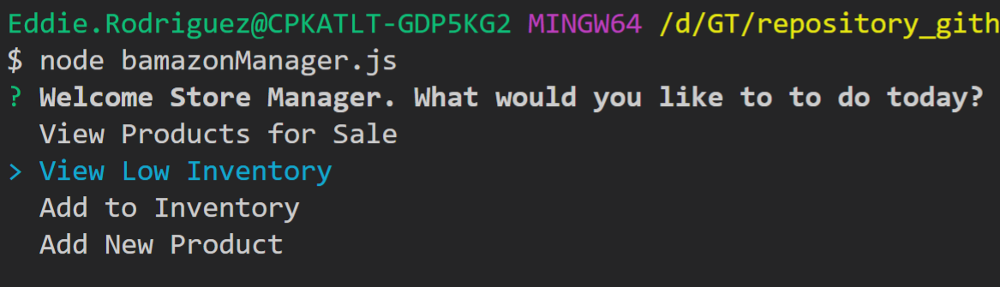

# Title: Storefront
### Contributor:       Eddie Rodriguez
### GitHub URL:        https://github.com/erodriguez87/storefront
### Video Example Customer View: https://youtu.be/aZSgXhHLNB8
### Video Example Manager View: https://youtu.be/DfHDKznm3zk

This is a node application made to show interactions between javascript and a sql database through node. It uses an inquirer package to communicate with the user and displays/writes to a sql table.

Available commands:

### Packages included

   * [Inquirer](https://www.npmjs.com/package/inquirer)
   * [mysql](https://www.npmjs.com/package/mysql)
   * [figlet](https://www.npmjs.com/package/figlet)

